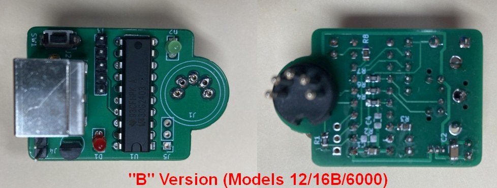

# Big-Tandy-Keyboard-Adapter
PS2 keyboard adapter for 'Big Tandy' computers - Models II, 12, 16, 16B, and 6000.

The keyboard allows you to use a PS2 keyboard with your 'Big Tandy' computer.  There are three versions:

### "A" Version
The A version is for the Models II and 16.  These models have the keyboard cable attached to the computer.  The adapter connects to the end of the cable and the PS2 keyboard to the adapter.

### "B" Version

The B version is for the Models 12, 16B, and 6000.  These models have the keyboard cable attached to the computer.  The adapter plugs directly into the keyboard plug on the front of the computer and the PS2 keyboard into the adapter.

### "AB" Version (universal)
The AB version is for all models.  It has a 5-pin header to connect a pigtail cable.  A pigtail with a male DIN5 connector for Models 12/16B/6000 or a pigtail with a female DIN5 connector for Models II/16.  The pinout differences are also accounted for in the pigtail cable.
